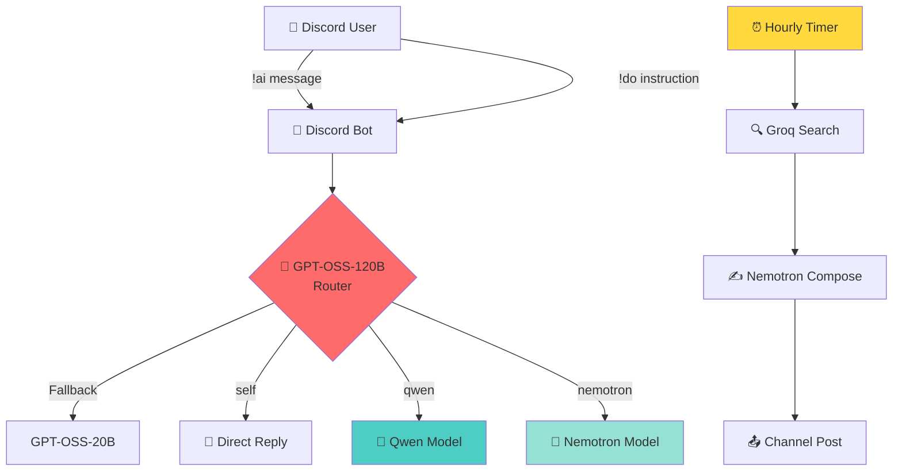

<div align="center">

# 🤖 AI-Powered Discord Admin Bot

### *Multi-Model Intelligence | Smart Routing | Automated Posts*

[](https://python.org)
[](https://discordpy.readthedocs.io/)
[](https://groq.com)
[](https://openrouter.ai)


*Ek intelligent Discord bot jo GPT-OSS-120B router ke saath multiple AI models ko orchestrate karta hai*

[Features](#-features) • [Installation](#-installation) • [Commands](#-commands) • [Architecture](#-architecture) • [Deploy](#-deploy)

---

</div>

## ✨ Features

<table>
<tr>
<td width="50%">

### 🧠 **Smart AI Router**
- **GPT-OSS-120B** primary router
- **GPT-OSS-20B** fallback system  
- Auto-delegates to specialized models:
  - 🐳 **Qwen** for general reasoning
  - 🚀 **Nemotron** for complex tasks

</td>
<td width="50%">

### 🎯 **Admin Commands**
- 📝 Natural language server control
- 🔧 Channel, role, member management
- 🚫 Moderation (kick, ban, timeout)
- 📢 Announcements & purge messages

</td>
</tr>
<tr>
<td width="50%">

### ⏰ **Scheduled Posts**
- Hourly auto-posts (configurable)
- 5 rotating topics:
  - 💻 Coding/DSA tips
  - 🤖 AI/Tech news  
  - 📱 Android dev tricks
  - 🎲 Random tech facts
  - 💪 Motivational quotes

</td>
<td width="50%">

### 🛡️ **Production Ready**
- 🔑 Multiple API key rotation
- 📊 Comprehensive logging
- 🔄 Auto-retry on failures
- 🌐 Keep-alive web server
- ☁️ Render deployment ready

</td>
</tr>
</table>

---

## 🏗️ Architecture



---

## 🚀 Installation

### Prerequisites

```bash
Python 3.10+
Discord Bot Token
Groq API Keys
OpenRouter API Keys
```

### Step 1: Clone & Setup

```bash
# Clone repository
git clone <your-repo-url>
cd discord-ai-bot

# Create virtual environment
python -m venv venv
source venv/bin/activate  # On Windows: venv\Scripts\activate

# Install dependencies
pip install -r requirements.txt
```

### Step 2: Environment Configuration

Create a `.env` file:

```env
# Discord Configuration
DISCORD_BOT_TOKEN=your_discord_bot_token_here

# Groq API Keys (comma-separated for rotation)
GROQ_API_KEYS=key1,key2,key3

# OpenRouter API Keys (comma-separated)
OPENROUTER_API_KEYS=key1,key2,key3

# Model Configuration (optional, has defaults)
GROQ_MODEL_ROUTER=openai/gpt-oss-120b
GROQ_MODEL_FALLBACK=openai/gpt-oss-20b
GROQ_MODEL_QWEN=qwen/qwen3.6-27b
OPENROUTER_MODEL_NEMOTRON=nvidia/nemotron-3-ultra-550b-a55b:free

# Bot Settings
COMMAND_PREFIX=!
DAILY_POST_CHANNEL_ID=1234567890123456789  # Your channel ID
```

### Step 3: Get Channel ID

1. Discord → User Settings → Advanced → **Enable Developer Mode**
2. Right-click target channel → **Copy Channel ID**
3. Paste in `.env` as `DAILY_POST_CHANNEL_ID`

---

## 💻 Commands

### 🎤 Chat Commands

```bash
!ai <message>              # Talk to AI assistant
!ai kaise ho?              # Hinglish support
!ai explain recursion      # Technical questions
```

### 🔧 Admin Commands (Admins Only)

#### Channel Management
```bash
!do create channel announcements
!do delete channel old-chat
!do set topic of announcements to "Latest updates here!"
```

#### Role Management
```bash
!do create role Moderator with color #ff0000
!do assign Moderator role to @username
!do remove Admin role from @username
```

#### Member Moderation
```bash
!do kick @username reason: spam
!do ban @username reason: toxic behavior
!do timeout @username for 30 minutes
!do change nickname of @username to NewName
```

#### Utilities
```bash
!do purge 10 messages
!do announce in general "Server maintenance tonight!"
!do post dal                    # Trigger scheduled post manually
```

---

## ⚙️ Configuration

### 🎯 Topics Customization

Edit `DAILY_TOPICS` in `ai_admin_bot_v2.py`:

```python
DAILY_TOPICS = [
    "Your custom topic 1",
    "Your custom topic 2",
    "Your custom topic 3",
    # Add more topics
]
```

### ⏰ Schedule Adjustment

Change posting frequency in the decorator:

```python
@tasks.loop(hours=1)  # Change to hours=2, hours=6, etc.
async def daily_post_task():
    ...
```

---

## 🌐 Deploy on Render

### Quick Deploy

[](https://render.com)

### Manual Setup

1. **Create New Web Service** on Render
2. **Connect GitHub Repository**
3. **Configure Build Settings:**
   ```
   Build Command: pip install -r requirements.txt
   Start Command: python ai_admin_bot_v2.py
   ```
4. **Add Environment Variables** (from `.env` file)
5. **Deploy!** 🚀

---

## 📊 Logs & Monitoring

Bot includes comprehensive logging:

```
[2026-07-26 10:12:12] [INFO    ] AIBot: ✅ Bot online hai: BotName
[2026-07-26 10:12:12] [INFO    ] AIBot: 📊 Servers: 3, Users: 1250
[2026-07-26 10:12:12] [INFO    ] AIBot: 🔑 Groq keys loaded: 3
[2026-07-26 10:12:12] [INFO    ] AIBot: ⏰ Daily post task started!
[2026-07-26 11:00:00] [INFO    ] AIBot: [Daily Post] Starting for topic: AI/Tech news
[2026-07-26 11:00:15] [INFO    ] AIBot: [Daily Post] ✅ Posted successfully
```

---

## 🔐 Security Best Practices

<table>
<tr>
<td>

✅ **DO**
- Use `.env` for secrets
- Add `.env` to `.gitignore`
- Rotate API keys regularly
- Use admin-only commands
- Monitor bot logs

</td>
<td>

❌ **DON'T**
- Commit secrets to Git
- Share API keys publicly
- Give bot admin without need
- Ignore rate limits
- Skip error handling

</td>
</tr>
</table>

---

## 🐛 Troubleshooting

### Bot Not Starting?

```bash
# Check Discord token
echo $DISCORD_BOT_TOKEN

# Verify dependencies
pip install -r requirements.txt

# Test imports
python -c "import discord; print(discord.__version__)"
```

### API Rate Limits?

- Bot automatically rotates between multiple keys
- Add more keys to `.env` (comma-separated)
- Check Groq/OpenRouter dashboard for limits

### Commands Not Working?

- Ensure bot has proper permissions
- Check command prefix matches (default: `!`)
- Admin commands need Administrator permission

---

## 📝 Requirements

```txt
discord.py>=2.0.0
requests>=2.31.0
python-dotenv>=1.0.0
Flask>=3.0.0
```

---

## 🤝 Contributing

Contributions welcome! Please:

1. Fork the repository
2. Create feature branch (`git checkout -b feature/AmazingFeature`)
3. Commit changes (`git commit -m 'Add AmazingFeature'`)
4. Push to branch (`git push origin feature/AmazingFeature`)
5. Open Pull Request

---

## 📜 License

This project is licensed under the MIT License - see the [LICENSE](LICENSE) file for details.

---

## 🙏 Acknowledgments

- [Discord.py](https://discordpy.readthedocs.io/) - Awesome Discord API wrapper
- [Groq](https://groq.com) - Ultra-fast LLM inference
- [OpenRouter](https://openrouter.ai) - Unified LLM API
- [Render](https://render.com) - Easy deployment platform

---

<div align="center">

### 🌟 Star this repo if you found it helpful!

Made with ❤️ and ☕

[⬆ Back to Top](#-ai-powered-discord-admin-bot)

</div>
